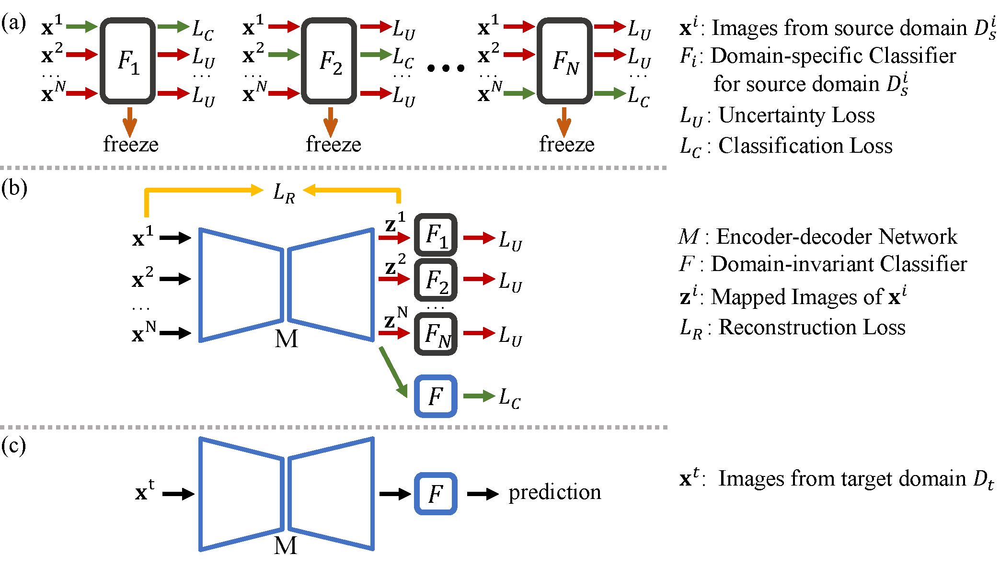

# Learning and Removing Domain-specific features for Generalization (LRDG)

## Introduction

This is the official implementation of
**Domain Generalization by Learning and Removing Domain-specific Features**, **NeurIPS 2022**



## Requirements

- python == 3.7.8
- PyTorch == 1.5.1
- Cuda == 10.1

## Usage

The detailed data settings are in the file models/datasets/datasets.py.
For example, Sketch is the target domain:

### Learning domain-specific features

 Training the domain-specific classifier for art painting:
```
python train_ds.py --src art,photo,cartoon --trg sketch
```
 Training the domain-specific classifier for photo:
```
python train_ds.py --src photo,cartoon,art --trg sketch
```
Training the domain-specific classifier for cartoon:
```
python train_ds.py --src cartoon,art,photo --trg sketch
```

### Removing domain-specific features
```
python train_lrdg.py --src art,photo,cartoon --trg sketch --resume ./checkpoints/sketch_art,photo,cartoon_train_ds/01000.pth#./checkpoints/sketch_photo,cartoon,art_train_ds/01000.pth#./checkpoints/sketch_cartoon,art,photo_train_ds/01000.pth
```

## Citation

```
@inproceedings{ding2022domain,
 title = {Domain Generalization by Learning and Removing Domain-specific Features},
 author = {Ding, Yu and Wang, Lei and Liang, Bin and Liang, Shuming and Wang, Yang and Chen, Fang},
 booktitle = {Advances in Neural Information Processing Systems},
 pages={24226--24239},
 volume={35},
 year = {2022}
}
```
